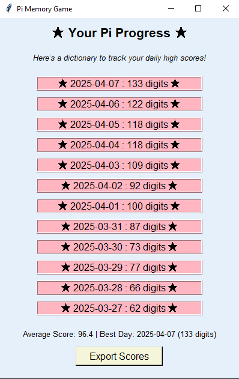
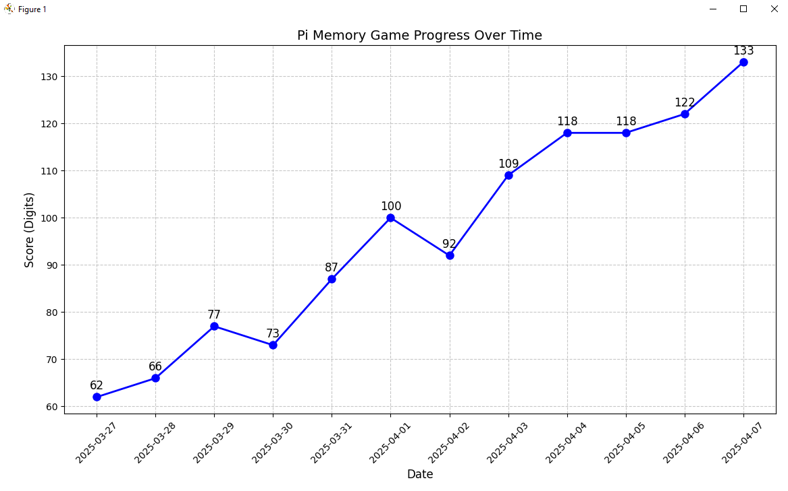

# Pi Memory Game

A fun and interactive memory game built with Python and Tkinter. Challenge yourself to memorize as many digits of π (pi) as you can!

## How to Play

- **Practice Mode**: This mode was designed for the sole purpose of learning pi! Enter as many correct digits as you can and if you get stuck or guess an incorrect digit a useful hint will pop up to help you continue. A mode like this is what allowed me to learn over 400 digits of pi in high school!
- **Real Game**: This mode tests your true memory of pi. The game will continue until you make 3 incorrect guesses.
- **Play with your keyboard or the on-screen buttons** and remember, it always starts with `"3."`.

Your score is the number of correct digits you get.

## Features

- GUI-based gameplay with **Tkinter**
- Tracks your **daily progress**
- Exports scores to CSV for fun or analysis
- Plots your performance with **matplotlib**
- Sound effects on wrong guesses and game over

## Example Screenshots
The screenshots below are my scores and improvement over time from playing my completed Pi Game.



> 


## Running the Game

Make sure you have Python and all necessary libraries installed. Then just run:

```bash
python pi_game.py
